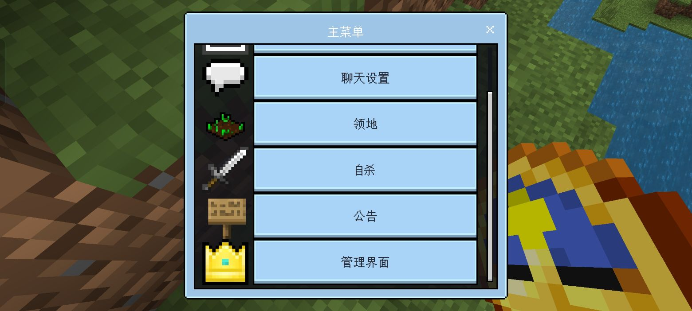
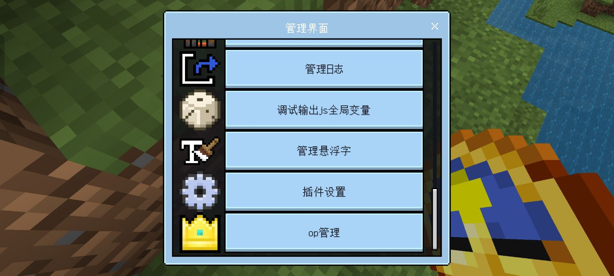

_#以下教程适用于USF V2版本_

1. 导入游戏  
- 使用MT管理器、7-zip、xz等工具打开下载的zip文件
- 选择USF(xxx).mcaddon导入至mc      

2. 初始化
- 创建存档，在 __实验性玩法__ 中打开「测试版API」和「实验相机功能」
- 在 __行为包__ 中启用USF
- 进入存档，在聊天栏内根据提示输入 `/function get_owner` 获取插件最高权限(服务器内操作详见"服务器端初始化.md")
  （**注意！由于MC本地存档默认你为服务器，所以本操作建议转到服务器进行**）

3. 游戏内设置
- 使用 `+cd`打开菜单，并按照如下步骤进行配置   
   [菜单]→[管理界面]→[插件设置]  
     

   **管理界面**

     

   **插件设置**

   找到[插件命令设置]，点击选择你需要的插件命令
   
